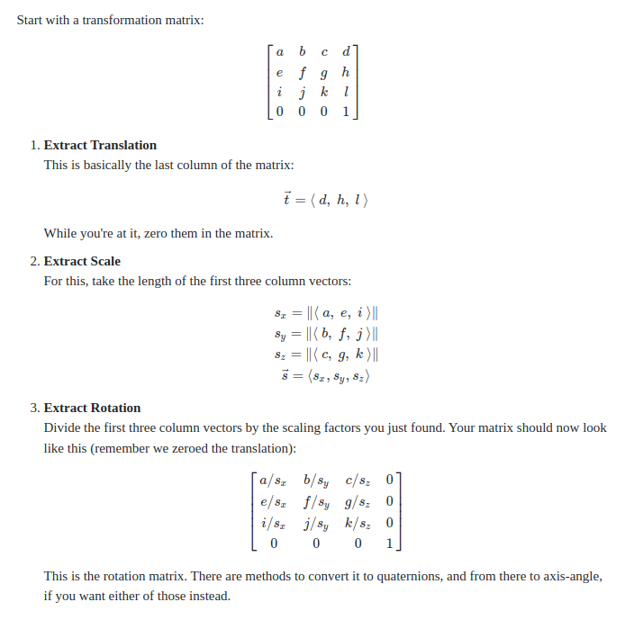

### Convert Data from Open3D format to ElasticFusion format

1. Transformation Matrix to translation and quaterion
    
      * Open3D format: 4x4 matrix (Homogeneous transformation matrix)
            [ link](/trajectory.txt)
      * ElasticFusion format: translation(tx, ty, tz) and quaterion(qx, qy, qz, qw)
            [ link](/trajectory.posegraph)

        

